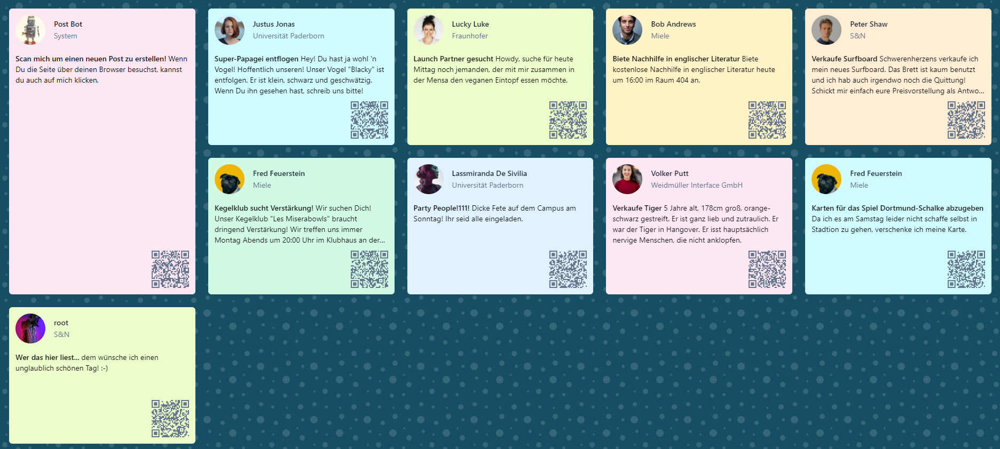

# Z-Board

The **Z-Board** is a digital notice board.



## Features
(coming soon)

## Multi-Repository Project
This repository is part of a multi-repository project.
In total, it consists of three repositories:
* [frontend](https://github.com/theovier/zboard-client)
* [backend](https://github.com/theovier/zboard-server)
* [docker-deployment](https://github.com/theovier/zboard-docker-deployment)

## Context
In its current state, the **Z-Board** is just a technical demonstration.
It is part of my master thesis and not to be treated as a serious, fully-fledged out project.


## Deployment
The code for the deployment can be found in a separate git [repository](https://github.com/theovier/zboard-docker-deployment).
When the server is restarted make sure to connect to its docker container via ```docker exec -it api /bin/bash``` and execute the following commands:

```bash
#clear all caches/routes/configs
php artisan cache:clear
php artisan config:clear
php artisan route:clear

#migrate and freshly seed the database
php artisan migrate:fresh --seed
```
